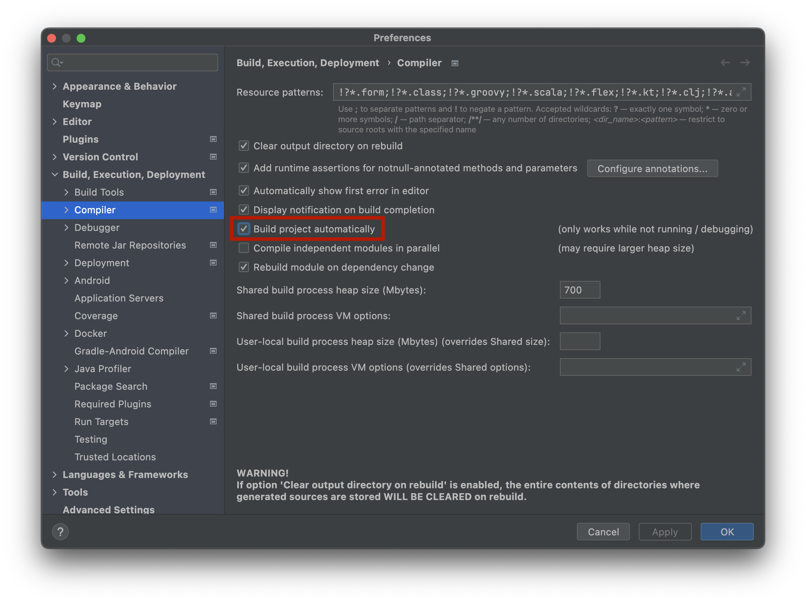
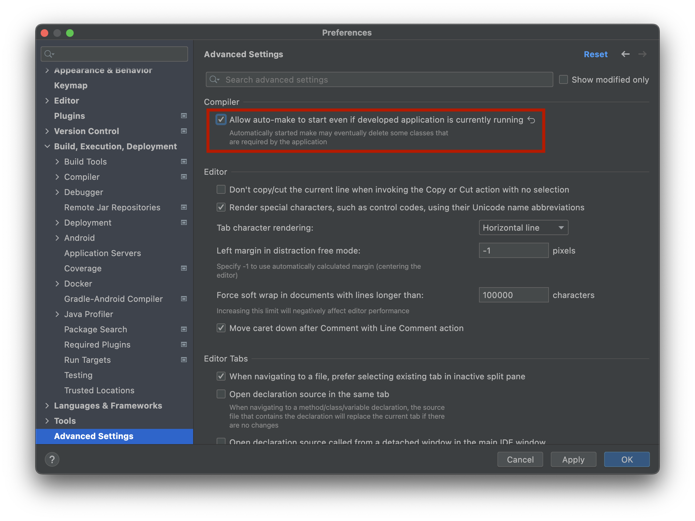

<h1 align="center">
Codehub
</h1>

<p align="center">
StackOverFlow like application for University, JEE project.
</p>

## ☀️ License

[MIT License](https://github.com/osmocode/jee-project/blob/main/LICENSE)

## 🖥 Prerequisites

In order to run the project you'll need the following tools installed

<!-- * [Maven 3.8.6](https://maven.apache.org/download.cgi) -->
* [Java 17](https://www.oracle.com/java/technologies/javase/jdk17-archive-downloads.html)
* [Node.js](https://nodejs.org/en/download/)
* [Npm](https://docs.npmjs.com/cli/v8/configuring-npm/install?v=true)

## ⌨️ Development

```bash
$ git clone https://github.com/osmocode/jee-project.git
$ cd jee-project
$ ./bin/install.sh
$ ./bin/start.sh
```

### LiveReload

1. First you need to install LiveReload extensions on your browser

* [Firefox LiveReload](https://addons.mozilla.org/fr/firefox/addon/livereload-web-extension/)
* [Google Chrome](https://chrome.google.com/webstore/detail/livereload/jnihajbhpnppcggbcgedagnkighmdlei)

2. Activate `Preferences > Build, Execution, Deployment > Compiler > Build project automatically`

<p>
    
</p>

3. Activate `Preferences > Advanced Settings > Compiler > Allow auto-make...`
On older version of IntelliJ this option is present on Registry with name `compiler.automake.allow.when.app.running`

<p>
    
</p>